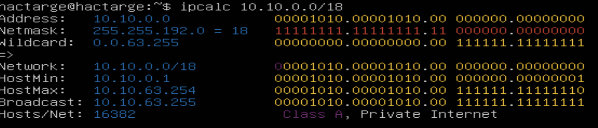
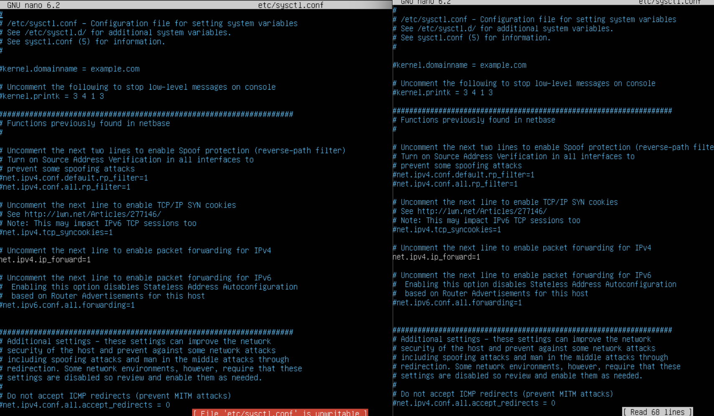

## Part 1.
* адрес сети 192.167.38.54/13 
* 255.255.255.0 в префиксной форме - /24, а в двоичной - 111111111.111111111.111111111.000000000 
* /15 - 111111111.111111110.000000000.000000000 
* 11111111.11111111.11111111.11110000 - /28 или 255.255.255.240 
* для адреса 12.167.38.4 при маске /8 минимальный хост - 12.0.0.1, максимальный хост 12.255.255.254 
* при маске 11111111.11111111.00000000.00000000 минимальный хост - 12.167.0.1, максимальный хост 12.167.255.254 
* 255.255.254.0 минимальный хост - 12.167.38.1, максимальный хост 12.167.39.254 
* /4  минимальный хост - 0.0.0.1, максимальный хост 15.255.255.254 
* диапазон 127.0.0.1-127.255.255.254 считается зарезервированным для localhost в данный диапозон попадают только два адреса - 127.0.0.2, 127.1.0.1, 194.34.23.100 и 128.0.0.1 не входят в этот диапозон поэтому через localhost мы обратиться к ним не сможем
* Диапазон адресов 10.0.0.0 - 10.255.255.255 (префикс /8).
* Диапазон адресов 172.16.0.0 - 172.31.255.255 (префикс /12).
* Диапазон адресов 192.168.0.0 - 192.168.255.255 (префикс /16).
* Эти диапазоны IP-адресов зарезервированы для использования в частных сетях и не маршрутизируются в Интернете. Они могут быть использованы в локальных сетях дома, офиса или других закрытых сетевых средах. IP 10.0.0.45 — частный, 134.43.0.2 — общедоступный, 192.168.4.2 — частный, 172.20.250.4 — частный, 172.0.2.1 — общедоступный, 192.172.0.1 — общедоступный, 172.68.0.2 — общедоступный, 172.16.255.255 — частный, 10 .10 .10.10 — частный, 192.169.168.1 — общедоступный.
* сеть 10.10.0.0/18 не может иметь IP-адрес шлюзов 10.0.0.1, 10.10.100.1 и может иметь 10.10.0.2, 10.10.10.10, 10.10.1.255 
## Part 2.
* Вывод команды ip a  
* lo представляет виртуальный сетевой интерфейс, который обеспечивает обратную связь с собой. Он используется для внутренней коммуникации внутри компьютера без фактической передачи данных по физическим сетевым интерфейсам.
* enp0s3 представляет физический Ethernet-интерфейс в системе. Обычно это сетевой адаптер, к которому подключается сетевой кабель. Этот интерфейс используется для подключения к локальной сети или Интернету. Он может быть настроен с помощью IP-адреса, маски подсети, шлюза и других сетевых параметров
* ws1 - 192.168.100.10, маска /16, ws2 - 172.24.116.8, маска /12 
* Выполнить команду netplan apply для перезапуска сервиса сети 
* Добавить статический маршрут от одной машины до другой и обратно при помощи команды вида ip r add 
* Добавление статического маршрута с сохранением 
* Пропинговать соединение между машинами 
## Part 3.
* 8 Mbps == 1 MB/s
* 100 MB/s == 819200 Kbps
* 1 Gbps == 1024 Mbps
* на второй машине запустим команду iperf3 -s чтобы он перешел в режим сервера, а на первой iperf3 -c 172.24.116.8 
## Part 4.
* Создать файл /etc/firewall.sh, имитирующий фаерволл, на ws1 и ws2 
* Запустить файлы на обеих машинах командами chmod +x /etc/firewall.sh и /etc/firewall.sh  
* Основная разница между этими стратегиями заключается в порядке применения запрещающих и разрешающих правил  
* Командой ping найти машину, которая не "пингуется", после чего утилитой nmap показать, что хост машины запущен  
## Part 5.
* Настроить конфигурации машин в etc/netplan/00-installer-config.yaml согласно сети на рисунке  
* Также пропинговать ws22 с ws21. Аналогично пропинговать r1 с ws11   
* Для включения переадресации IP, выполните команду на роутерах: sysctl -w net.ipv4.ip_forward=1  
* Откройте файл /etc/sysctl.conf и добавьте в него следующую строку: net.ipv4.ip_forward = 1  
* Настроить маршрут по-умолчанию (шлюз) для рабочих станций. Для этого добавить default перед IP роутера в файле конфигураций  
* Вызвать ip r и показать, что добавился маршрут в таблицу маршрутизации 
* Пропинговать с ws11 роутер r2 и показать на r2, что пинг доходит. Для этого использовать команду: tcpdump -tn -i eth1 
* Добавить в роутеры r1 и r2 статические маршруты в файле конфигураций 
* Запустить команды на ws11: ip r list 10.10.0.0/[маска сети] и ip r list 0.0.0.0/0 
при команде ip r list 10.10.0.0/18 выводится ip который будет использоваться при отправке пакетов сетевого трафика в этом диапазоне IP-адресов,  а при ip r list 0.0.0.0/0 будет показан информацию о маршруте по умолчанию.
* Запуск на r1 команды дампа tcpdump -tnv -i ent0 и построение списка маршрутизаторов на пути от ws11 до ws21 при помощи утилиты traceroute  
Traceroute - это утилита сетевой диагностики, которая используется для определения маршрута, по которому проходят сетевые пакеты от отправителя к получателю. Она позволяет отследить путь прохождения пакетов через различные узлы (роутеры) в сети от начального отправителя до конечного пункта назначения.

Принцип работы traceroute основан на отправке серии пакетов с увеличивающимся значением поля "Time to Live" (TTL). TTL - это поле в заголовке IP-пакета, которое указывает максимальное количество маршрутизаторов, которые пакет может проходить до своей истечения и возврата обратно отправителю.

* Запуск на r1 перехвата сетевого трафика, проходящего через eth0 с помощью команды tcpdump -n -i eth0 icmp и пинг с ws11 несуществующего IP ping -c 1 10.30.0.111 

## Part 6.

* Для r2 настроить в файле /etc/dhcp/dhcpd.conf конфигурацию службы DHCP 
* в файле resolv.conf прописать nameserver 8.8.8.8. 
* Перезагрузить службу DHCP командой systemctl restart isc-dhcp-server. Машину ws21 перезагрузить при помощи reboot и через ip a показать, что она получила адрес. Также пропинговать ws22 с ws21   
* Указать MAC адрес у ws11, для этого в etc/netplan/00-installer-config.yaml надо добавить строки: macaddress: 10:10:10:10:10:BA, dhcp4: true 
* Для r1 настроить аналогично r2, но сделать выдачу адресов с жесткой привязкой к MAC-адресу (ws11). Провести аналогичные тесты  
* Запросить с ws21 обновление ip адреса 
* Команда dhclient -r выполняет освобождение арендованного IP-адреса и отключение DHCP-клиента. Она отправляет запрос серверу DHCP для освобождения ранее полученного IP-адреса и снятия аренды. 
* Команда dhclient запускает DHCP-клиент и инициирует процесс запроса IP-адреса у DHCP-сервера. Клиент отправляет запрос на получение IP-адреса и других сетевых настроек. DHCP-сервер анализирует запрос и назначает IP-адрес и другие параметры клиенту.

## Part 7.

* В файле /etc/apache2/ports.conf на ws22 и r1 изменить строку Listen 80 на Listen 0.0.0.0:80, то есть сделать сервер Apache2 общедоступным 
* Запустить веб-сервер Apache командой service apache2 start на ws22 и r1 

* Добавить в фаервол, созданный по аналогии с фаерволом из Части 4, на r2 следующие правила:
1) удаление правил в таблице filter - iptables -F
2) удаление правил в таблице "NAT" - iptables -F -t nat
3) отбрасывать все маршрутизируемые пакеты - iptables --policy FORWARD DROP

* Проверить соединение между ws22 и r1 командой ping (не должна "пинговаться") 
* Добавить в файл ещё одно правило: разрешить маршрутизацию всех пакетов протокола ICMP 
* Проверить соединение между ws22 и r1 командой ping (должна "пинговаться") 
* включить SNAT, а именно маскирование всех локальных ip из локальной сети, находящейся за r2 (по обозначениям из Части 5 - сеть 10.20.0.0) 
* Включить DNAT на 8080 порт машины r2 и добавить к веб-серверу Apache, запущенному на ws22, доступ извне сети 
* Проверить соединение по TCP для SNAT, для этого с ws22 подключиться к серверу Apache на r1 командой:
* Проверка соединения по TCP для DNAT, для этого с r1 подключиться к серверу Apache на ws22 командой telnet (обращаться по адресу r2 и порту 8080): 

## Part 8.

* Запуск веб-сервера Apache на ws22 только на localhost 
* Воспользоваться Local TCP forwarding с ws21 до ws22, чтобы получить доступ к веб-серверу на ws22 с ws21 
* Воспользоваться Remote TCP forwarding c ws11 до ws22, чтобы получить доступ к веб-серверу на ws22 с ws11 
* Проверка подключения 

